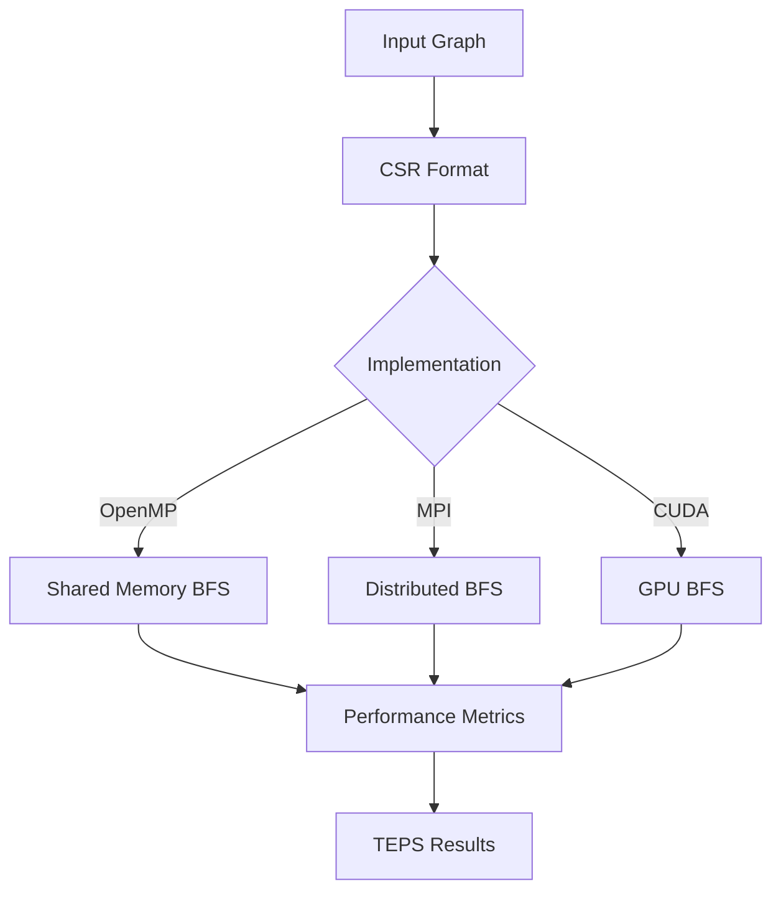

# Project Structure

```
Parallel-Breadth-First-Search-Algorithm/
├── 📄 README.md                    # Main documentation with badges & setup
├── 📄 LICENSE                      # MIT License  
├── 📄 CONTRIBUTING.md              # Contribution guidelines
├── 📄 REQUIREMENTS.md              # System requirements & setup
├── 📄 .gitignore                   # Git ignore rules
│
├── 🛠️  Build System
│   └── makefile                    # Unified build system for all implementations
│
├── 💻 Source Code  
│   ├── openmp.cpp                  # OpenMP shared memory BFS implementation
│   ├── mpi.cpp                     # MPI distributed memory BFS implementation  
│   └── cuda-imp.cu                 # CUDA GPU-accelerated BFS implementation
│
├── 📊 Documentation & Reports
│   ├── Rshukla7_Final_Report.pdf   # Academic final report
│   └── Rshukla7_Project_Slides.pdf # Project presentation slides
│
└── ⚙️  CI/CD & Automation
    └── .github/workflows/
        └── ci.yml                   # GitHub Actions CI pipeline
```

## File Descriptions

### 🎯 Core Implementations

#### [openmp.cpp](openmp.cpp)
**Shared Memory Parallel BFS using OpenMP**
- **Algorithm**: Direction-optimizing BFS with dynamic switching
- **Parallelism**: Thread-level parallelization with race-free updates
- **Features**: 
  - Thread-local frontier queues
  - Guided scheduling for load balancing  
  - α/β threshold-based algorithm switching
  - Built-in serial verification
- **Input**: Vertex count and source vertex OR graph file
- **Output**: BFS levels, timing, verification results

#### [mpi.cpp](mpi.cpp) 
**Distributed Memory Parallel BFS using MPI**
- **Algorithm**: 2D block-partitioned matrix-vector BFS
- **Parallelism**: Process-level with optimized communication
- **Features**:
  - r×r processor grid layout
  - Reduced communication volume (~42% vs 1D)
  - Overlapped computation and communication
  - Symmetric frontier exchange
- **Input**: Vertex count, source vertex, processor grid size
- **Output**: BFS levels, communication stats, timing

#### [cuda-imp.cu](cuda-imp.cu)
**GPU-Accelerated Parallel BFS using CUDA**  
- **Algorithm**: Direction-optimal kernels (top-down + bottom-up)
- **Parallelism**: Massive thread-level parallelization
- **Features**:
  - Persistent CSR graph storage  
  - Atomic frontier updates
  - Bitmap frontier representation
  - Minimal PCIe overhead (<5%)
- **Input**: Vertex count, source vertex OR CSR graph file
- **Output**: BFS levels, GPU timing, memory usage

### 🛠️ Build System

#### [makefile](makefile)
**Unified Build System**
- **Targets**: `all`, `mpi_bfs`, `omp_bfs`, `cuda_bfs`, `clean`
- **Run Helpers**: `run_mpi`, `run_omp`, `run_cuda`  
- **Customization**: Configurable compilers and flags
- **Features**: 
  - Cross-platform compatibility
  - Parallel builds support
  - Clean dependency management

### 📚 Documentation

#### [README.md](README.md)
**Main Project Documentation**
- Professional badges and tech stack icons
- Comprehensive setup and usage instructions  
- Performance benchmarks and comparisons
- Algorithmic design explanations
- Contributing guidelines

#### [CONTRIBUTING.md](CONTRIBUTING.md) 
**Contributor Guidelines**
- Development environment setup
- Code style and standards
- Performance benchmarking requirements
- Pull request process
- Community guidelines

#### [REQUIREMENTS.md](REQUIREMENTS.md)
**System Requirements & Setup**
- Hardware requirements for each implementation
- Software dependencies and installation
- Environment configuration  
- Performance tuning recommendations

### 🚀 CI/CD

#### [.github/workflows/ci.yml](.github/workflows/ci.yml)
**GitHub Actions CI Pipeline**
- Multi-compiler testing (GCC, Clang)
- Automated build verification
- Code quality checks  
- Documentation validation
- Cross-platform compatibility testing

## Data Flow Architecture



## Memory Layout

### CSR (Compressed Sparse Row) Format
```
Vertices: 0  1  2  3  4
Edges:    A--B--C
          |     |
          D-----E

Row Pointers: [0, 2, 4, 5, 7, 8]
Columns:      [1, 3, 0, 2, 1, 2, 4, 3]
```

### Frontier Representations
- **OpenMP**: `std::vector<int>` frontier lists
- **MPI**: Distributed bitmap slices  
- **CUDA**: GPU-resident bitmaps with atomic updates

## Performance Characteristics

| Implementation | Memory Pattern | Communication | Scalability |
|---------------|----------------|---------------|-------------|
| **OpenMP** | Shared cache-friendly | None | CPU cores |  
| **MPI** | Distributed partitioned | Collective ops | Cluster nodes |
| **CUDA** | GPU global memory | PCIe transfers | GPU threads |